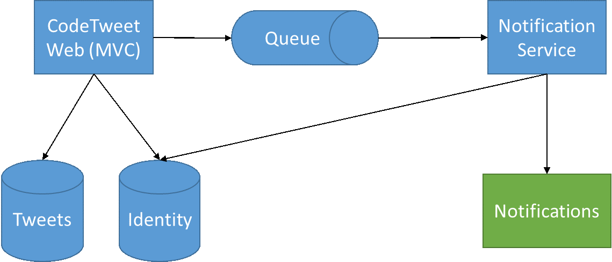

# Azure Cloud Camp - Course Exercise

## CodeTweet

## Introduction
During the Azure Cloud Camp, participants will practice hands-on the usage of various Azure services. 
The exercises are built in the form of a "rolling exercise". We start off with a simple on premise standard web application, and we gradually migrate more and more of its features into the cloud each week until the system appears as it was born in the cloud.

## Background

### Base Scenario
The "CodeTweet" system is an enterprise web-based on premise system meant to act as an organization's message board. Registered users can post tweets comprising of up to 140 characters each, and all other users can view these tweets. In addition, users can subscribe to receive notifications on posted tweets causing the system to notify them when such a tweet is posted.
The system's architecture is depicted in the following diagram:

 

1.	Users use the ASP.NET MVC 5 web-based application as their front-end to the system.
2.	Users' identities are managed using ASP.NET Identity with Entity Framework over a SQL Server database.
3.	Users' tweets are stored in a Tweets DB with Entity Framework over a SQL Server database.
4.	The two system databases can share the same physical DB instance, but it is not required and they are actually decoupled.
5.	New tweets are posted to a queue in order to be processed for sending notifications to registered users. The queue is implemented using NetMQ, which is a .NET implementation of ZeroMQ.
6.	The Notifications Service is a backend service, responsible for pulling new tweets from the queue and sending notifications to registered users as a background process. It is implemented with TopShelf, meaning it can be hosted both as a console application for debugging and a Windows Service for production. The current implementation simply logs each notification into a log file, but it could send out an email, SMS, etc.

## Getting & Running the Code
The entire system source code, including instructions on compiling and running the system, can be found [here](CodeTweet).
 

## Exercise 1 – IaaS Lift & Shift

### Objective
The objective of this exercise is to migrate the entire system to Azure for running on a dedicated Windows VM.

### Tasks
1.	Create a new Windows VM in Azure.
2.	Install IIS on the VM.
3.	Install SQL Server Express on the VM.
4.	Upload the system binaries manually to the destination server and deploy the system.
5.	Check that the web interface can be accessed from outside of Azure.
6.	Bonus – configure automated deployment to IIS with MS Deploy to allow seamless deployment from Visual Studio to a preconfigured production VM.

## Exercise 2 – Storage & Data
### Objective
The objective of this exercise is to migrate both SQL Server databases to Azure SQL Databases, and to migrate the queue to an Azure Queue. Optionally, the Tweets DB can be migrated to Table Storage or DocumentDB.

### Tasks
1.	Create a new Azure SQL Server and set it up to replace the current SQL Server database, including both system databases (Tweets DB and Identity DB).
2.	Replace the Tweets database implementation with Azure Tables 
3.	Add ability to upload an image with the tweet, save the image to the Blob Storage and make sure the tweet will now contain the correct URL of the image (don’t forget to set the correct access policy)
4.	Bonus 1: Choose one of the options (or both)
a.	Create a Storage Account and replace the current ZeroMQ with an Azure Storage Queue
b.	Replace the Tweets database implementation with DocumentDB 
5.	Bonus 2: Add ability to upload an image with the tweet, save the image to the Blob Storage and make sure the tweet will now contain the correct URL of the image (don’t forget to set the correct access policy)

## Exercise 3 – Azure App Service

### Objective
The objective of this exercise is to migrate the Front-End & Back-End services to the Azure App Service.

### Tasks
1.	Migrate the Web project to a Web App.
2.	Replace the worker implementation with a WebJob.
3.	Create an Azure SQL DB to be used by the system.
4.	Upon deployment to the App Service, configure the application to use an Azure SQL DB for both application databases. These databases can share a single DB instance, as is initially configured.

### Bonus
1.	Replace the WebJob implementation with an Azure Function.
2.	Create a Deployment Slot for staging. Deploy a new version of your service and make a swap.
a.	Note: to use Deployment Slots you have to change your Service Plan to Standard (or Premium) which costs more. Don’t forget to close the App Plan when you’re done
b.	Note: this item will not be checked.

