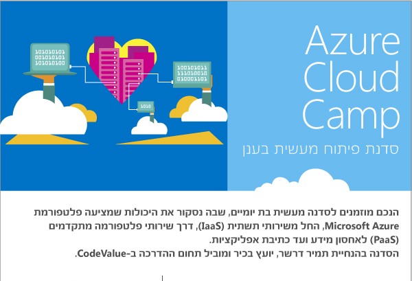
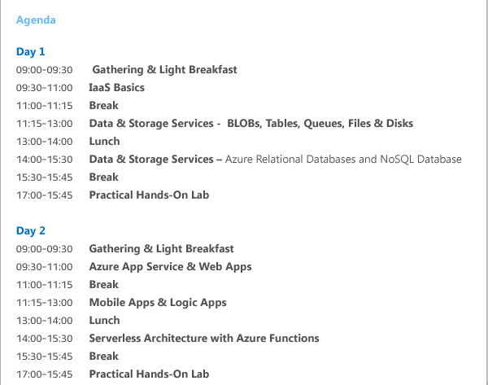

# Azure Cloud Camp
## February 2017
This repositoty holds the material from the Microsoft February Cloud Camp

Slides can be found [here](Slides)

Exercise and Hands-on labs can be found [here](Exercise)

## Installations
* Visual Studio 2015 (Community edition or other) - https://www.visualstudio.com/downloads/
* Azure SDK - https://go.microsoft.com/fwlink/?LinkId=518003&clcid=0x409
* Cloud Explorer for Visual Studio 2015 - https://marketplace.visualstudio.com/items?itemName=MicrosoftCloudExplorer.CloudExplorerforVisualStudio2015
* Azure Storage Explorer - https://go.microsoft.com/fwlink/?LinkId=698844&clcid=0x409
* if you prefer to work with other environments (such as Node.js), please download the appropriate SDK from here https://azure.microsoft.com/en-us/downloads/
